# Goal
Support new and potential students in Computer Science by helping them discover career paths and opportunities for learning and growth in Hawaii. 

# Overview
The Problem:
There is a high dropout rate in lower level ICS courses for potential students because of lack of motivation and unawareness of resources available. New students have a false stigma of what computer science emcompasses. Sometimes students may have feelings of isolation working alone which also decreases motivation.

The Solution:
Easily accessible searchable and filterable database of opportunities available for ICS students in Hawaii that is categorized by: internships, clubs, volunteer opportunities, hackathons, jobs, projects, professional organizations, networking events, skill building. More awareness of opportunities will lead to a lower dropout rate, clear focus of career goals, and improve motivation. The landing page will be designed to be more appealing to freshman. A friending system will help students discover and create study groups to work better and improve resilience. 

# User Guide

### Sign Up | Home Page
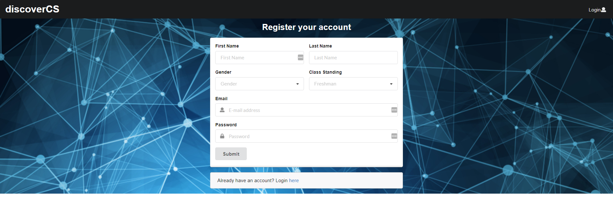 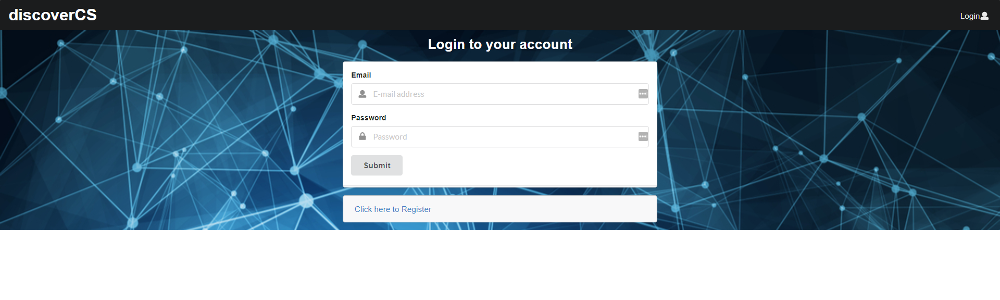  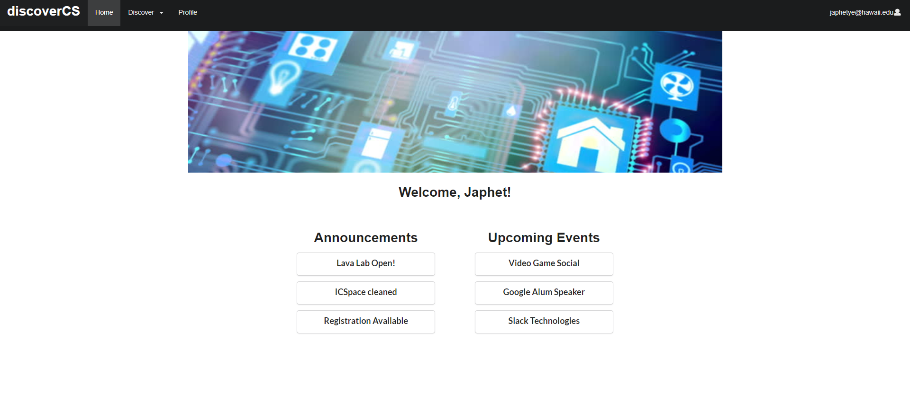
At the sign up page, you can select a minimum of three interests to get your profile started.
When you reach the home page, a mind map of your interests will populate, and you can see the announcements and events. 

### Explore Careers | Explore Interests
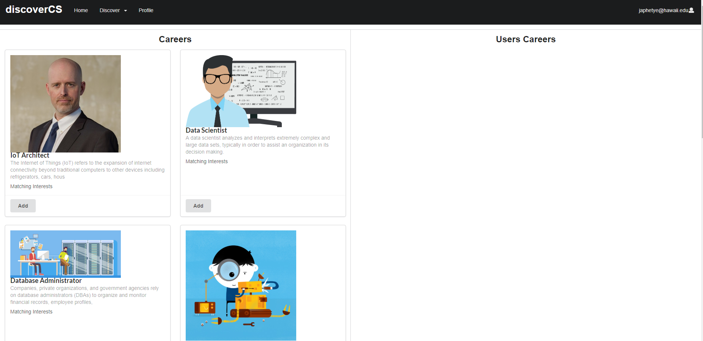
On the explore careers page, certain career words will be larger than others if you have more interests connected to it. 
On the explore interests page, there are three types: technical, subject, and field interests.

### Interests: Technologies
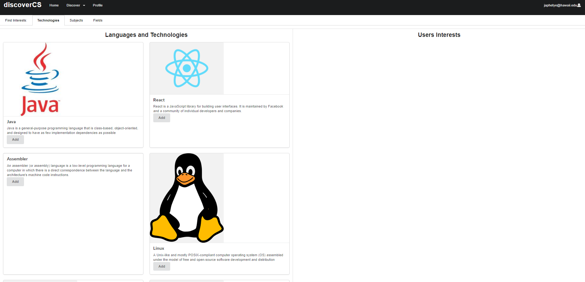
You can explore the list of a specific category of interests, such as Technical (languages). You can drag items from the list to your side on the right. 

# Developer Guide
1. Install [Meteor](https://www.meteor.com/install)
2. Clone a copy of dcs using Github.
3. Open the Command Prompt/Terminal window and cd into the app directory within the dcs directory.
4. Once within dcs/app enter the following command to install the libraries:
`$ meteor npm install`

5. Run the following command to get the system running:
`$ meteor npm run start`

6. You can now access the downloaded build of the site on Google Chrome, or a similar browser by typing:
`$ localhost:3000`

# Community Feedback
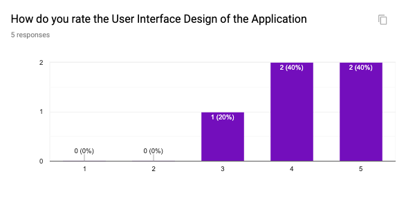
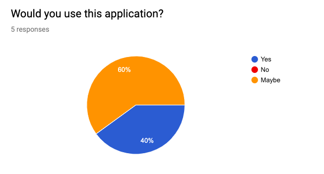
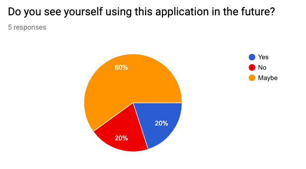
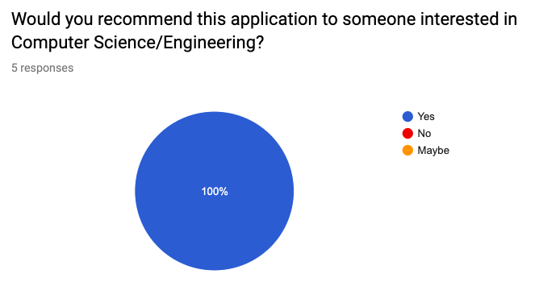
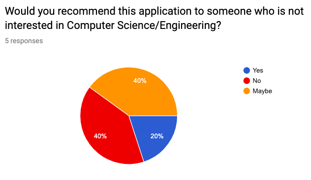
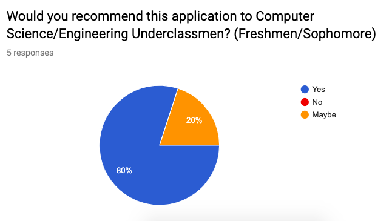
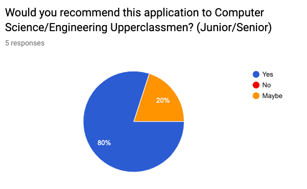

