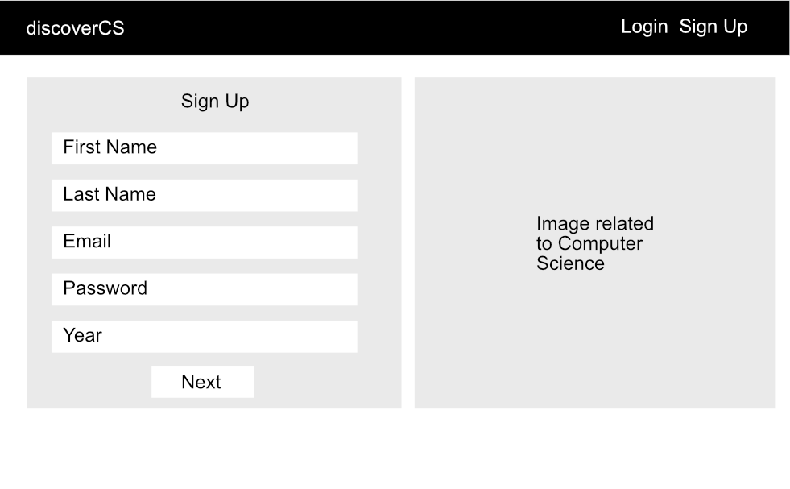
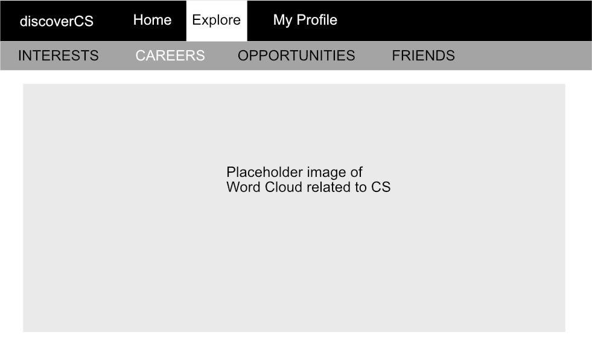

# Goal
Support new and potential students in Computer Science by helping them discover career paths and opportunities for learning and growth in Hawaii. 

# Overview
The Problem:
There is a high dropout rate in lower level ICS courses for potential students because of lack of motivation and unawareness of resources available. New students have a false stigma of what computer science emcompasses. Sometimes students may have feelings of isolation working alone which also decreases motivation.

The Solution:
Easily accessible searchable and filterable database of opportunities available for ICS students in Hawaii that is categorized by: internships, clubs, volunteer opportunities, hackathons, jobs, projects, professional organizations, networking events, skill building. More awareness of opportunities will lead to a lower dropout rate, clear focus of career goals, and improve motivation. The landing page will be designed to be more appealing to freshman. A friending system will help students discover and create study groups to work better and improve resilience. 

# User Guide
1. New users: browse the landing page to get an idea of what the website can offer and help you with. 
2. Sign up, pick a minimum of three interests that you know or want to learn more about
3. On the home page, you can see your mind map of interests and career connections.
   You can also see recent announcements, an event calendar, and deadlines.  
4. On the explore page, browse and add interests, careers, opportunities to your profile.
   When you add an opportunity to your profile, if it is an event or scholarship/internship, the deadline will show on the calendar. 
   When you add interests or careers from the explore page, your mind map is updated so you can see the new connections. 
   You can also find people with simmilar interests to you, who can be potential teammates or study friends.
 
 
# Overview of Pages
- Landing Page highlighting three key features:
 - Discover Everything: Interests, Careers, Opportunities: Events, Internships, Scholarships.
 - Find Friends: See people with similar interests as you
 - Events and Deadlines: See scholarship/internship application deadlines and the community event calendar.
- Sign up: Users initially choose a minimum of three interests to populate the explore page.
- Home Page: Personal mindmap, upcoming events and announcements.
- Explore Pages:
 - Interests: See technical, personal, and field specific interests. 
 - Careers: See how your interests connect to potential careers.
 - Opportunities: Discover community events, hackathons, internships, and scholarships.
 - Friends: Find people or potential teammates with similar interests.
- My Profile:
 - Display your saved interests, careers, and opportunities

# Mockups
## Top Level:
### Sign Up | Home Page
 
At the sign up page, you can select a minimum of three interests to get your profile started.
When you reach the home page, a mind map of your interests will populate, and you can see the announcements and events. 

## Mid Level:
### Explore Careers | Explore Interests
 
On the explore careers page, certain career words will be larger than others if you have more interests connected to it. 
On the explore interests page, there are four types: personal, technical, subject, and field interests.

## Low Level
### Interest Languages

You can explore the list of a specific category of interests, such as Technical (languages). You can drag items from the list to your side on the right. 

# Use Cases
- New Freshman just getting to know and explore the ICS community and resources in Hawaii

# Beyond the basic
- Friend system
- Mind Maps
- Notifications for events and deadlines
- See other users with same interests
- Reporting System
