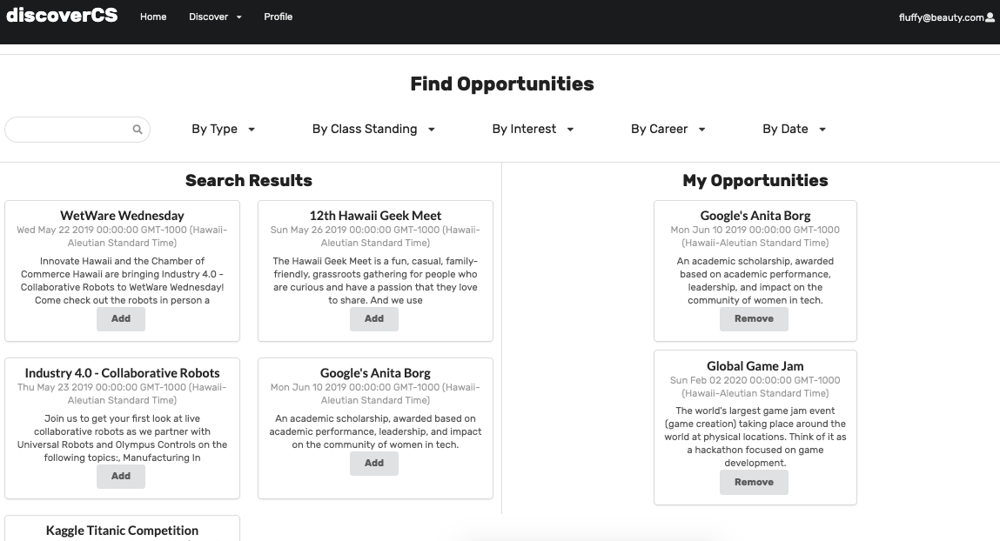
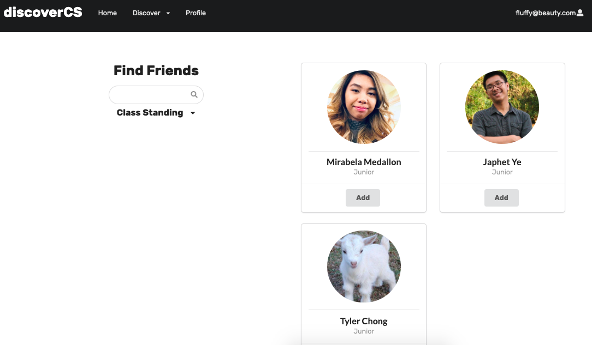
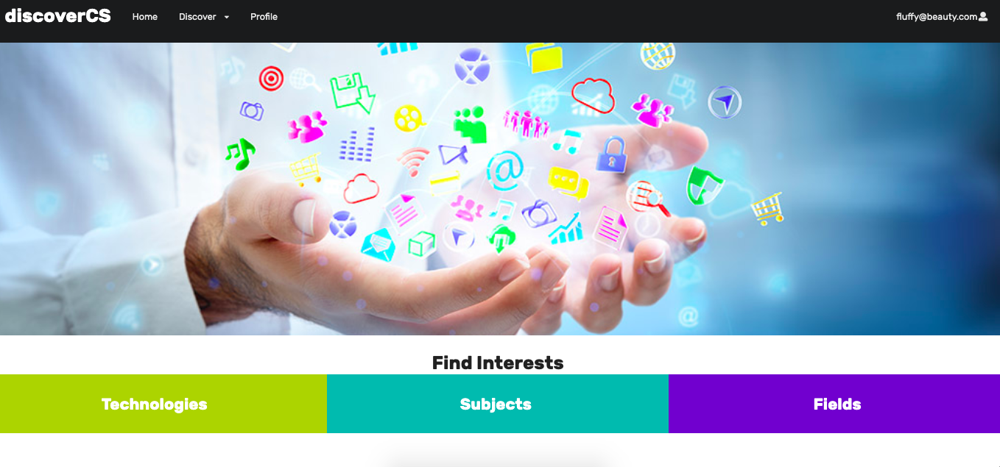
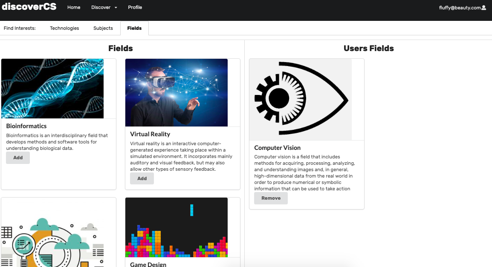
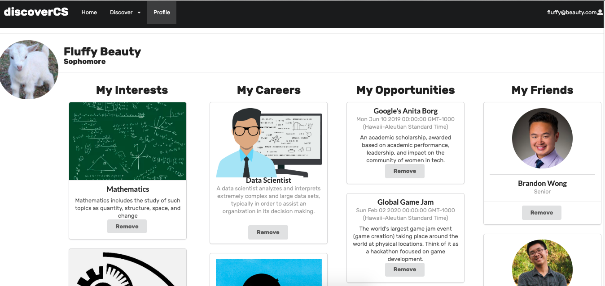

# Overview
The Goal: 
Support new and potential students in Computer Science by helping them discover career paths and opportunities for learning and growth in Hawaii. 

The Problem:
There is a high dropout rate in lower level ICS courses for potential students because of lack of motivation and unawareness of resources available. New students have a false stigma of what computer science emcompasses. Sometimes students may have feelings of isolation working alone which also decreases motivation.

The Solution:
Easily accessible searchable and filterable database of opportunities available for ICS students in Hawaii. More awareness of opportunities will lead to a lower dropout rate, clear focus of career goals, and improve motivation. A friending system will help students discover and create study groups to work better and improve resilience. 

# User Guide

### Sign Up, Sign In, Home Page
At the sign up page, enter your first and last name, gender, class standing, email, and password.
 

If you already have an account, please sign in.
 

When you reach the home page, you can see recent announcement posts and upcoming events.

### Explore Opportuinties 
You can find Opportunities through the search bar or filtering by: type, class standing, interest, and career.
The search results appear on the right and your saved opportunities are on the left. There are three types of interests: scholarships, internships, and events. If you filter by career or interest, only opportunities with those related interests or careers will show up.

### Explore Careers
On the careers page, you can view a list of careers on the left and see your saved careers on the right.

### Explore Friends
You can find users by searching their name or filtering by class standing. The search results appear on the right. 

### Explore Interests
On the explore interests page, there are three types: technical, subject, and field interests.

#### Interests: Technologies
You can explore the list of a specific category of interests, such as Technical. Technical interests include languages, frameworks, and technologies in computer science. You can add items from the list to your side on the right. 

#### Interests: Fields
Here is another category of interests: fields. These are subfields of computer science. 

### Your Profile
On your profile, you can see the Interests, Careers, Opportunities, and Friends you added. You can also remove them from your profile on here. 

# Developer Guide
1. Install [Meteor](https://www.meteor.com/install)
2. Clone a copy of dcs using Github.
3. Open the Command Prompt/Terminal window and cd into the app directory within the dcs directory.
4. Once within dcs/app enter the following command to install the libraries:
`$ meteor npm install`

5. Run the following command to get the system running:
`$ meteor npm run start`

6. You can now access the downloaded build of the site on Google Chrome, or a similar browser by typing:
`$ localhost:3000`

# Community Feedback
The purpose of the app was to appeal to new or potential students in computer science, and based on the community feedback, we achieved that purpose.  
100% of respondents indicated that they recommend this application to someone interested in Computer Science/Engineering.
80% of respondents indicated that they would recommend this application to Computer Science/Engineering Underclassmen?

However, 40% of respondents indicated that they you would NOT recommend this application to someone who is not interested in Computer Science/Engineering. It seems we can improve by making the website more appealing to students without much interest.

# Contact Us
Mirabela Medallon: mirabela@hawaii.edu
Brandon Wong: bwong7@hawaii.edu
Japhet Ye: japhetye@hawaii.edu
