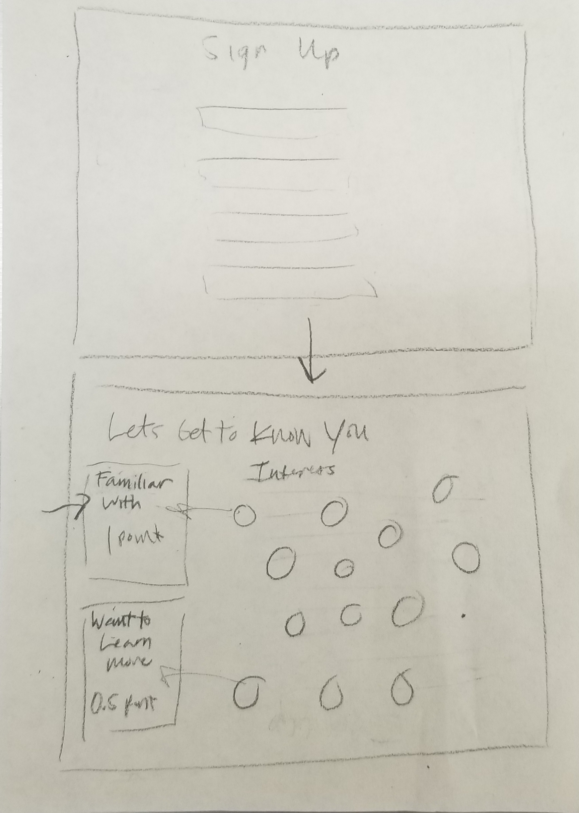
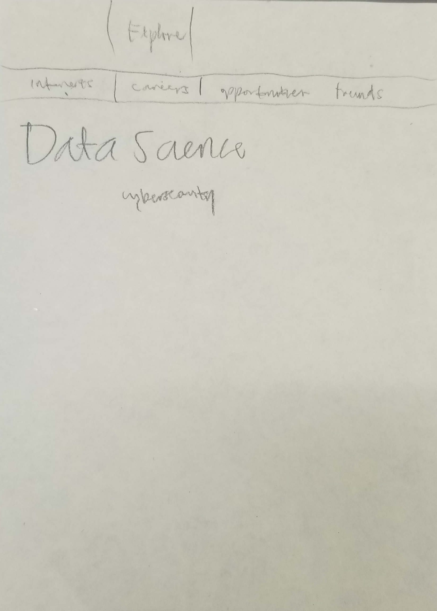
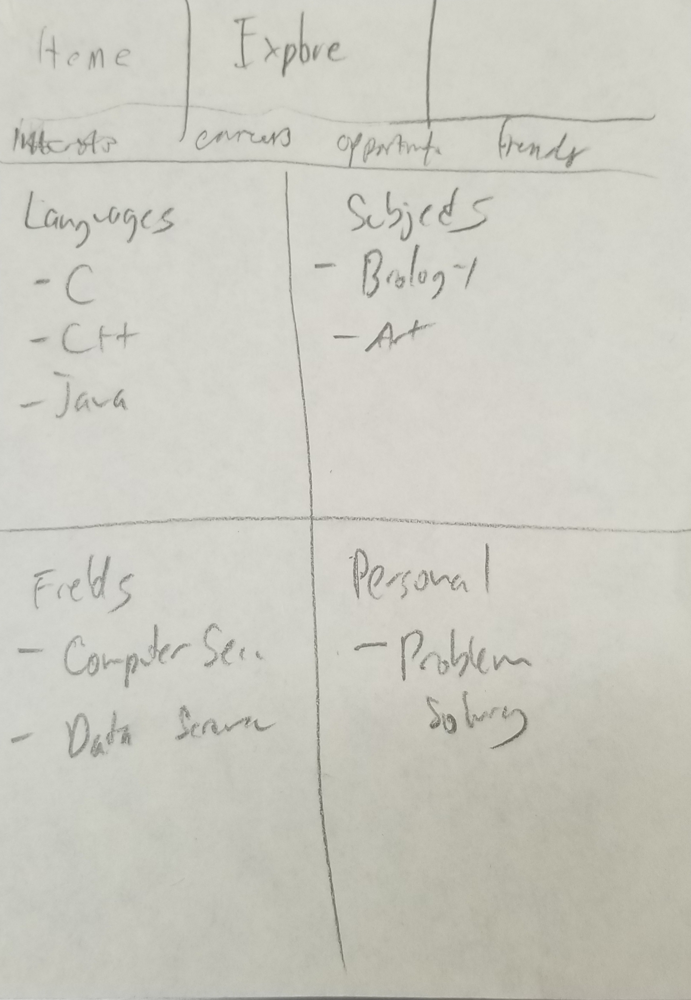
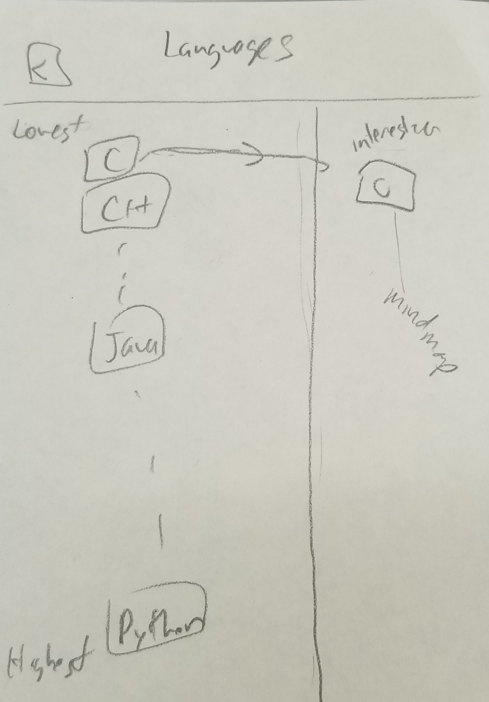

# Goal
Support new and potential students in Computer Science by helping them discover career paths and opportunities for learning and growth in Hawaii. 

# Overview
The Problem:
There is a high dropout rate in lower level ICS courses for potential students because of lack of motivation and unawareness of resources available. New students have a false stigma of what computer science emcompasses. Sometimes students may have feelings of isolation working alone which also decreases motivation.

The Solution:
Easily accessible searchable and filterable database of opportunities available for ICS students in Hawaii that is categorized by: internships, clubs, volunteer opportunities, hackathons, jobs, projects, professional organizations, networking events, skill building. More awareness of opportunities will lead to a lower dropout rate, clear focus of career goals, and improve motivation. The landing page will be designed to be more appealing to freshman. A friending system will help students discover and create study groups to work better and improve resilience. 

# Approach
 
 
# Overview of Pages
- Landing Page highlighting three key features:
 - Discover Everything: Interests, Careers, Opportunities: Events, Internships, Scholarships.
 - Find Friends: See people with similar interests as you
 - Events and Deadlines: See scholarship/internship application deadlines and the community event calendar.
- Sign up: Users initially choose a minimum of three interests to populate the explore page.
- Home Page: Personal mindmap, upcoming events and announcements.
- Explore Pages:
 - Interests: See technical, personal, and field specific interests. 
 - Careers: See how your interests connect to potential careers.
 - Opportunities: Discover community events, hackathons, internships, and scholarships.
 - Friends: Find people or potential teammates with similar interests.
- My Profile:
 - Display your saved interests, careers, and opportunities

# Mockups
## Top Level:
### Sign Up | Home Page
 

## Mid Level:
### Explore Careers | Explore Interests
 

## Low Level
### Interest Languages

# Use Cases
- New Freshman just getting to know and explore the ICS community and resources in Hawaii

# Beyond the basic
- Friend system
- Mind Maps
- Notifications for events and deadlines
- See other users with same interests
- Reporting System
